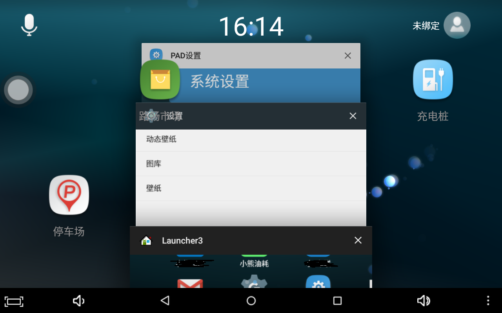

##Android 应用背景加载系统动态壁纸
 
###需求
 
 客户的需求总是那么让人摸不着头脑，我们的应用和系统的launcher是共同存在的**双桌面**形式，客户要求应用必须支持系统桌面的壁纸，针对这个需求，静态壁纸很容易实现，但是**动态壁纸**就很麻烦了，毕竟我们的只是一个应用伪launcher，并不是在真正的launcher源码上进行更改的桌面程序。
 
###思路
 
 在网上查了很多资料之后才有了一点思路，动态壁纸并不是运行在activity界面，虽然都是以apk的形式存在于android系统中，但是主要是运行在一个**壁纸窗口**的**WallPaperService**。所以需要将我们的应用主题设置成**透明**，再将动态壁纸的窗口贴合应用的acivity窗口，后面看过android原生**launcher3**的源码之后发现系统也是这样实现的

###实现

####1.透明背景
将应用的主Activity的主题设置为**透明**

     <activity
            android:name=".activity.MainActivity"
            android:launchMode="singleTask"
            android:screenOrientation="landscape"
            android:theme="@android:style/Theme.Translucent.NoTitleBar.Fullscreen">
            <intent-filter>
                <action android:name="android.intent.action.MAIN"/>
                <category android:name="android.intent.category.DEFAULT" />
                <category android:name="android.intent.category.HOME" />
                <category android:name="android.intent.category.LAUNCHER"/>
            </intent-filter>
        </activity>

#### 2.壁纸窗口贴合Acivity窗口
通过设置当前窗口的属性，添加显示壁纸窗口的标志，将壁纸窗口贴合在应用背景，当不需要时清除标志

      if(isLiveWall){
            getWindow().addFlags(WindowManager.LayoutParams.FLAG_SHOW_WALLPAPER);
        }else {
            getWindow().clearFlags(WindowManager.LayoutParams.FLAG_SHOW_WALLPAPER);
        }

#### 3.关闭系统对话框
完成前两步之后，便可以将当前系统的动态壁纸加载到应用背景上，如果是非launcher的应用这样就已经完成功能了。但是因为我们应用是一个双桌面，具有桌面的home属性，测试过中发现，在Activity窗口和壁纸窗口之间会叠加出现一个**最近任务的系统对话框和原生launcher桌面**
大概的样子就是这样：

背景全部重叠在一起，推测**最近任务的对话框应该是默认显示在壁纸窗口之上**，没有关闭的话就会显示在我们透明的背景下，所以需要关闭掉类似的系统对话框。

而系统launcher桌面也会叠加的原因是，因为launche3在也是默认透明背景显示壁纸窗口的，两个activity窗口都标志显示壁纸的话，壁纸窗口会显示在最底层的系统桌面窗口。
但是系统默认的桌面是没有这些问题的，所以在系统launcher的源码中，应该存在解决方案

     protected void onNewIntent(Intent intent) {
        long startTime = 0;
        if (DEBUG_RESUME_TIME) {
            startTime = System.currentTimeMillis();
        }
        super.onNewIntent(intent);

        boolean alreadyOnHome = mHasFocus && ((intent.getFlags() &
                Intent.FLAG_ACTIVITY_BROUGHT_TO_FRONT)
                != Intent.FLAG_ACTIVITY_BROUGHT_TO_FRONT);

        // Check this condition before handling isActionMain, as this will get reset.
        boolean shouldMoveToDefaultScreen = alreadyOnHome &&
                mState == State.WORKSPACE && getTopFloatingView() == null;

        boolean isActionMain = Intent.ACTION_MAIN.equals(intent.getAction());
        if (isActionMain) {
            // also will cancel mWaitingForResult.
            closeSystemDialogs();
    }
       public void closeSystemDialogs() {
        getWindow().closeAllPanels();

        // Whatever we were doing is hereby canceled.
        setWaitingForResult(null);
    }

在onNewIntent回调中我们可以发现，当launcher收到返回桌面的Intent时，会调用 closeSystemDialogs()来关闭系统对话框，在我们的代码中加入此段代码即可关闭系统对话框

    protected void onNewIntent(Intent intent) {
        super.onNewIntent(intent);
        if(intent.getAction().equals(Intent.ACTION_MAIN)){
            closeSystemDialogs();
        }
    }
    
     private void closeSystemDialogs() {
        getWindow().closeAllPanels();
        Intent close = new Intent(Intent.ACTION_CLOSE_SYSTEM_DIALOGS);
        sendBroadcast(close);
    }

#### 4.设置动态壁纸
到了这里也还没完，根据用户的需求，需要设置一个默认的动态壁纸，然后找了半天发现只有静态壁纸的设置API,动态壁纸的除非自己写的，是没有提供开放的API，还好在[	
Stack Overflow](https://stackoverflow.com/questions/13683464/set-live-wallpaper-programmatically-on-rooted-device-android/32637179#32637179) 上面找到一个可以通过反射来实现的方法，但是必须是有系统权限

    <uses-permission android:name="android.permission.SET_WALLPAPER_COMPONENT" />

然后调用hide类的方法**IWallpaperManager.setWallpaperComponent(ComponentName)**来实现

     public void setLiveWallPaper(String wallPaper){
        try
        {
            WallpaperManager manager = WallpaperManager.getInstance(mContext);
            Method method = WallpaperManager.class.getMethod("getIWallpaperManager", new Class[]{});
            Object objIWallpaperManager = method.invoke(manager, new Object[]{});
            Class[] param = new Class[1];
            param[0] = ComponentName.class;
            method = objIWallpaperManager.getClass().getMethod("setWallpaperComponent", param);

            //get the intent of the desired wallpaper service. Note: I created my own
            //custom wallpaper service. You'll need a class reference and package
            //of the desired live wallpaper
            Intent intent = new Intent(WallpaperService.SERVICE_INTERFACE);
            intent.setClassName("com.android.noisefield", "com.android.noisefield.NoiseFieldWallpaper");
            //set the live wallpaper (throws security exception if you're not system-privileged app)
            method.invoke(objIWallpaperManager, intent.getComponent());
        } catch (IllegalArgumentException e) {
            e.printStackTrace();
        } catch (IllegalAccessException e) {
            e.printStackTrace();
        } catch (NoSuchMethodException e) {
            e.printStackTrace();
        } catch (InvocationTargetException e) {
            e.printStackTrace();
        }
    }

 **intent.setClassName("com.android.noisefield", "com.android.noisefield.NoiseFieldWallpaper");**
 这里可以替换成，自己定义的动态壁纸或者其他Android 自带动态壁纸的包名，壁纸服务名
##总结
前前后后总共花了三天才搞定这个需求，一开始想的太简单，还好**源码**和**StackOverflow** 帮了大忙，以后一定要多读系统源码